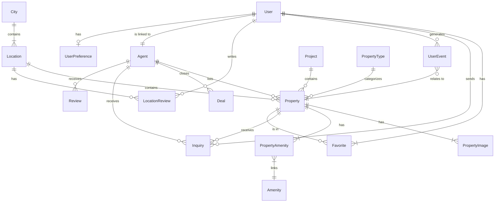

# Database Architecture & Schema Guide

## 1. Entity-Relationship Diagram (ERD)
This diagram illustrates the high-level relationships between the main tables in the database.

## 2. Table Reference
Here is a comprehensive breakdown of every table in the database schema.

### A. Authentication & Users
#### `User`
The core identity table.
| Column | Type | Description |
| :--- | :--- | :--- |
| **id** | Int | Primary Key (Auto-increment). |
| **email** | String | Unique email address used for login. |
| **password** | String | Hashed password. |
| **role** | Enum | `USER`, `ADMIN`, or `AGENT`. Controls access permissions. |
| **name** | String? | Display name of the user. |

#### `UserPreference`
Stores settings for personalized property recommendations.
| Column | Type | Description |
| :--- | :--- | :--- |
| **userId** | Int | Foreign key to `User`. Unique (1:1). |
| **purpose** | String | Search preference: 'BUY', 'RENT', 'BOTH'. |
| **propertyType** | String | 'HOUSE', 'APARTMENT', 'BOTH'. |
| **minPrice** | Decimal | Lower bound for price filtering. |
| **maxPrice** | Decimal | Upper bound for price filtering. |

#### `Favorite`
Junction table for users saving properties they like.
| Column | Type | Description |
| :--- | :--- | :--- |
| **userId** | Int | Link to the user. |
| **propertyId** | String | Link to the property. |

---

### B. Real Estate Structure (Inventory)
#### `Property`
The central table representing a listing (House, Apartment, Land).
| Column | Type | Description |
| :--- | :--- | :--- |
| **id** | UUID | Unique identifier. |
| **title** | String | Main title of the listing. |
| **price** | Decimal | Listing price. |
| **purpose** | String | 'SALE' or 'RENT'. |
| **adminId** | Int? | Agent managing the listing. |
| **locationId** | Int? | The specific neighborhood/area. |
| **projectId** | Int? | If part of a larger project (development). |
| **imageUrl** | String | Key/Path to the main cover image. |
| **bedrooms** | Int | Number of bedrooms. |
| **bathrooms** | Int | Number of bathrooms. |
| **areaSqm** | Int | Size in square meters. |

#### `Project`
Represents a large development (e.g., "Empire World Towers") containing multiple units.
| Column | Type | Description |
| :--- | :--- | :--- |
| **id** | Int | Primary Key. |
| **name** | String | Project name. |
| **status** | Enum | `PRE_SELLING`, `COMPLETED`, `commercial`, etc. |
| **priceRange** | String | Display text like "$100k - $200k". |

#### `PropertyType`
Categorization for properties.
| Column | Type | Description |
| :--- | :--- | :--- |
| **id** | Int | Primary Key. |
| **name** | String | e.g., "Villa", "Apartment", "Office". |

#### `PropertyImage`
Gallery images for a specific property.
| Column | Type | Description |
| :--- | :--- | :--- |
| **propertyId** | String | Link to the property. |
| **imageKey** | String | Path to the file in Backblaze B2 storage. |
| **sortOrder** | Int | Order in which to display the image. |

#### `Amenity`
Features available (e.g., "Swimming Pool", "WiFi").
| Column | Type | Description |
| :--- | :--- | :--- |
| **id** | Int | Primary Key. |
| **name** | String | Display name of the feature. |
| **icon** | String? | Icon reference identifier. |

#### `PropertyAmenity`
Junction table linking Properties to Amenities.
| Column | Type | Description |
| :--- | :--- | :--- |
| **propertyId** | String | Link to property. |
| **amenityId** | Int | Link to amenity. |

---

### C. Geography
#### `City`
Top-level geographical unit.
| Column | Type | Description |
| :--- | :--- | :--- |
| **id** | Int | Primary Key. |
| **name** | String | Name of the city (e.g., "Erbil"). |

#### `Location`
Sub-areas or neighborhoods within a city.
| Column | Type | Description |
| :--- | :--- | :--- |
| **cityId** | Int | Link to the parent City. |
| **name** | String | Name of the area (e.g., "Dream City"). |

#### `LocationReview`
User reviews/ratings for specific neighborhoods or areas.
| Column | Type | Description |
| :--- | :--- | :--- |
| **id** | Int | Primary Key. |
| **locationId** | Int | Link to the Location being reviewed. |
| **userId** | Int? | Optional link to the User who wrote the review. |
| **rating** | Int | 1-5 star rating for the area. |
| **comment** | String? | Optional text comment. |
| **createdAt** | DateTime | When the review was submitted. |

---

### D. Agents & Business Logic
#### `Agent`
Extended profile for users who are real estate agents.
| Column | Type | Description |
| :--- | :--- | :--- |
| **userId** | Int? | Link to the `User` account. |
| **name** | String | Full name displayed to public. |
| **phone** | String | Contact number. |
| **image** | String | Path to profile picture. |
| **experience** | Int | Years of experience. |
| **rating** | Float | Average rating from reviews. |

#### `AgentLanguage` & `Language`
Many-to-Many relationship storing languages an agent speaks (e.g., "English", "Kurdish").

#### `AgentSpecialization` & `Specialization`
Many-to-Many relationship storing agent skills (e.g., "Commercial", "Luxury").

#### `Deal`
Records of successful sales or rentals.
| Column | Type | Description |
| :--- | :--- | :--- |
| **agentId** | Int | Who closed the deal. |
| **propertyId** | String | What was sold/rented. |
| **price** | Decimal | Final transaction price. |
| **status** | Enum | `PENDING`, `COMPLETED`, `CANCELLED`. |
| **clientName** | String | Name of the buyer/renter. |

#### `Inquiry`
Leads/messages from users.
| Column | Type | Description |
| :--- | :--- | :--- |
| **propertyId** | String | Property of interest. |
| **userId** | Int? | Registered user who sent the inquiry. |
| **agentId** | Int | Agent receiving the lead. |
| **message** | String | User's message. |
| **type** | String | `TOUR` (request visit) or `MESSAGE` (question). |
| **status** | String | Tracking status (e.g., `PENDING`). |

#### `Review`
Feedback left for agents.
| Column | Type | Description |
| :--- | :--- | :--- |
| **agentId** | Int | The agent being reviewed. |
| **rating** | Int | 1-5 star rating. |
| **text** | String | The comment content. |

### E. Other
#### `PageView`
Analytics for tracking traffic.
| Column | Type | Description |
| :--- | :--- | :--- |
| **path** | String | The URL/Route visited. |
| **userId** | Int? | Who visited (if logged in). |

#### `UserEvent`
Tracks user behavior for AI ranking.
| Column | Type | Description |
| :--- | :--- | :--- |
| **userId** | Int? | Who performed the action. |
| **sessionId** | String? | Anonymous session ID. |
| **eventType** | String | `view_phone`, `share`, `view_gallery`. |
| **propertyId** | String? | Related property. |
| **metadata** | String? | JSON extra details. |
 
#### `WebsiteReview`
General testimonials for the platform itself (not specific agents).
| Column | Type | Description |
| :--- | :--- | :--- |
| **text** | String | Testimonial content. |
| **rating** | Int | Rating. |
